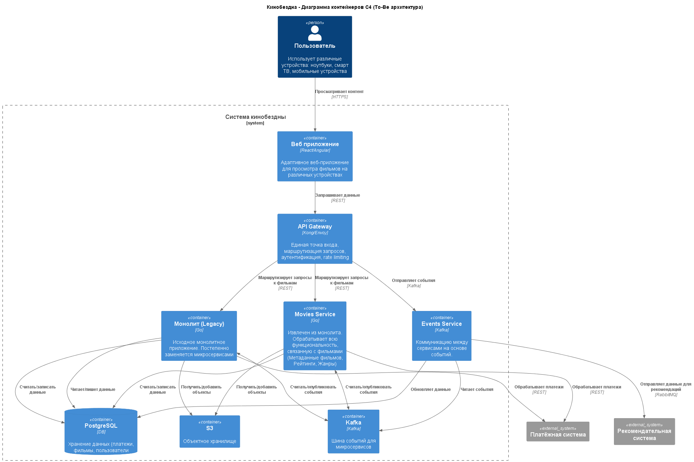
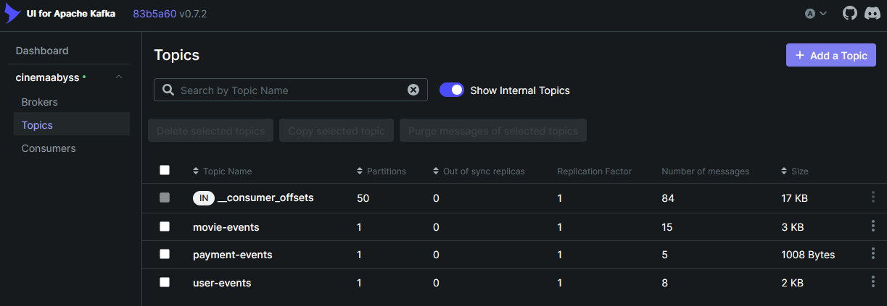
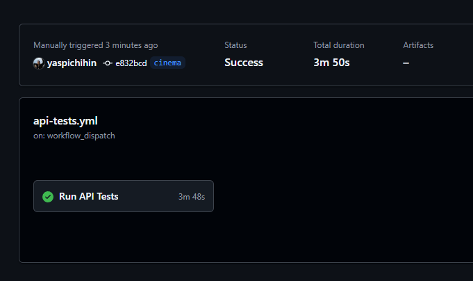

## Изучите [README.md](.\README.md) файл и структуру проекта.

# Задание 1

1. Спроектируйте to be архитектуру КиноБездны, разделив всю систему
   на отдельные домены и организовав интеграционное взаимодействие и
   единую точку вызова сервисов. Результат представьте в виде контейнерной
   диаграммы в нотации С4.



# Задание 2

### 1. Proxy

Команда КиноБездны уже выделила сервис метаданных о фильмах movies и вам необходимо реализовать бесшовный переход с применением паттерна Strangler Fig в части реализации прокси-сервиса (API Gateway), с помощью которого можно будет постепенно переключать траффик, используя фиче-флаг.

Реализуйте сервис на любом языке программирования в ./src/microservices/proxy.
Конфигурация для запуска сервиса через docker-compose уже добавлена

```yaml
proxy-service:
  build:
    context: ./src/microservices/proxy
    dockerfile: Dockerfile
  container_name: cinemaabyss-proxy-service
  depends_on:
    - monolith
    - movies-service
    - events-service
  ports:
    - "8000:8000"
  environment:
    PORT: 8000
    MONOLITH_URL: http://monolith:8080
    #монолит
    MOVIES_SERVICE_URL: http://movies-service:8081 #сервис movies
    EVENTS_SERVICE_URL: http://events-service:8082
    GRADUAL_MIGRATION: "true" # вкл/выкл простого фиче-флага
    MOVIES_MIGRATION_PERCENT: "50" # процент миграции
  networks:
    - cinemaabyss-network
```

- После реализации запустите postman тесты - они все должны быть зеленые (кроме events).
- Отправьте запросы к API Gateway:
  ```bash
  curl http://localhost:8000/api/movies
  ```
- Протестируйте постепенный переход, изменив переменную окружения MOVIES_MIGRATION_PERCENT в файле docker-compose.yml.

Результаты теста
```bash
$ npm run test:local

> cinemaabyss-api-tests@1.0.0 test:local
> node run-tests.js --environment local

Running tests against local environment...
newman: could not find "htmlextra" reporter
  ensure that the reporter is installed in the same directory as newman
  please install reporter using npm

newman

CinemaAbyss API Tests

□ Monolith Service
└ Health Check
  GET http://127.0.0.1:8080/health [200 OK, 124B, 13ms]
  √  Status code is 200

└ Get All Users
  GET http://127.0.0.1:8080/api/users [200 OK, 279B, 4ms]
  √  Status code is 200
  √  Response is an array

└ Create User
  POST http://127.0.0.1:8080/api/users [201 Created, 181B, 8ms]
  √  Status code is 201
  √  Response has id

└ Get User by ID
  GET http://127.0.0.1:8080/api/users?id=4 [200 OK, 176B, 3ms]
  √  Status code is 200
  √  User ID matches

└ Get All Movies
  GET http://127.0.0.1:8080/api/movies [200 OK, 1.38kB, 4ms]
  √  Status code is 200
  √  Response is an array

└ Create Movie
  POST http://127.0.0.1:8080/api/movies [201 Created, 245B, 8ms]
  √  Status code is 201
  √  Response has id

└ Get Movie by ID
  GET http://127.0.0.1:8080/api/movies?id=6 [200 OK, 240B, 3ms]
  √  Status code is 200
  √  Movie ID matches

└ Create Payment
  POST http://127.0.0.1:8080/api/payments [201 Created, 193B, 5ms]
  √  Status code is 201
  √  Response has id

└ Get Payment by ID
  GET http://127.0.0.1:8080/api/payments?id=4 [200 OK, 185B, 3ms]
  √  Status code is 200
  √  Payment ID matches

└ Create Subscription
  POST http://127.0.0.1:8080/api/subscriptions [201 Created, 235B, 4ms]
  √  Status code is 201
  √  Response has id

└ Get Subscription by ID
  GET http://127.0.0.1:8080/api/subscriptions?id=4 [200 OK, 230B, 2ms]
  √  Status code is 200
  √  Subscription ID matches

□ Movies Microservice
└ Health Check
  GET http://127.0.0.1:8081/api/movies/health [200 OK, 124B, 3ms]
  √  Status code is 200
  √  Status is true

└ Get All Movies
  GET http://127.0.0.1:8081/api/movies [200 OK, 1.51kB, 4ms]
  √  Status code is 200
  √  Response is an array

└ Create Movie
  POST http://127.0.0.1:8081/api/movies [201 Created, 282B, 7ms]
  √  Status code is 201
  √  Response has id

└ Get Movie by ID
  GET http://127.0.0.1:8081/api/movies?id=7 [200 OK, 277B, 2ms]
  √  Status code is 200
  √  Movie ID matches

□ Events Microservice
└ Health Check
  GET http://127.0.0.1:8082/api/events/health [errored]
     connect ECONNREFUSED 127.0.0.1:8082
  2. Status code is 200
  3. Status is true

└ Create Movie Event
  POST http://127.0.0.1:8082/api/events/movie [errored]
     connect ECONNREFUSED 127.0.0.1:8082
  5. Status code is 201
  6. Response has status success

└ Create User Event
  POST http://127.0.0.1:8082/api/events/user [errored]
     connect ECONNREFUSED 127.0.0.1:8082
  8. Status code is 201
  9. Response has status success

└ Create Payment Event
  POST http://127.0.0.1:8082/api/events/payment [errored]
     connect ECONNREFUSED 127.0.0.1:8082
 11. Status code is 201
 12. Response has status success

□ Proxy Service
└ Health Check
  GET http://127.0.0.1:8000/health [200 OK, 140B, 163ms]
  √  Status code is 200

└ Get All Movies via Proxy
  GET http://127.0.0.1:8000/api/movies [200 OK, 1.73kB, 35ms]
  √  Status code is 200
  √  Response is an array

└ Get All Users via Proxy
  GET http://127.0.0.1:8000/api/users [200 OK, 401B, 32ms]
  √  Status code is 200
  √  Response is an array

┌─────────────────────────┬───────────────────┬──────────────────┐
│                         │          executed │           failed │
├─────────────────────────┼───────────────────┼──────────────────┤
│              iterations │                 1 │                0 │
├─────────────────────────┼───────────────────┼──────────────────┤
│                requests │                22 │                4 │
├─────────────────────────┼───────────────────┼──────────────────┤
│            test-scripts │                22 │                0 │
├─────────────────────────┼───────────────────┼──────────────────┤
│      prerequest-scripts │                 0 │                0 │
├─────────────────────────┼───────────────────┼──────────────────┤
│              assertions │                42 │                8 │
├─────────────────────────┴───────────────────┴──────────────────┤
│ total run duration: 4.9s                                       │
├────────────────────────────────────────────────────────────────┤
│ total data received: 5.82kB (approx)                           │
├────────────────────────────────────────────────────────────────┤
│ average response time: 14ms [min: 2ms, max: 163ms, s.d.: 33ms] │
└────────────────────────────────────────────────────────────────┘

   #  failure             detail

 01.  Error               connect ECONNREFUSED 127.0.0.1:8082
                          at request
                          inside "Events Microservice / Health Check"

 02.  AssertionError      Status code is 200
                          expected { Object (id, _details, ...) } to have property 'code'
                          at assertion:0 in test-script
                          inside "Events Microservice / Health Check"

 03.  JSONError           Status is true
                          "undefined" is not valid JSON
                          at assertion:1 in test-script
                          inside "Events Microservice / Health Check"

 04.  Error               connect ECONNREFUSED 127.0.0.1:8082
                          at request
                          inside "Events Microservice / Create Movie Event"

 05.  AssertionError      Status code is 201
                          expected { Object (id, _details, ...) } to have property 'code'
                          at assertion:0 in test-script
                          inside "Events Microservice / Create Movie Event"

 06.  JSONError           Response has status success
                          "undefined" is not valid JSON
                          at assertion:1 in test-script
                          inside "Events Microservice / Create Movie Event"

 07.  Error               connect ECONNREFUSED 127.0.0.1:8082
                          at request
                          inside "Events Microservice / Create User Event"

 08.  AssertionError      Status code is 201
                          expected { Object (id, _details, ...) } to have property 'code'
                          at assertion:0 in test-script
                          inside "Events Microservice / Create User Event"

 09.  JSONError           Response has status success
                          "undefined" is not valid JSON
                          at assertion:1 in test-script
                          inside "Events Microservice / Create User Event"

 10.  Error               connect ECONNREFUSED 127.0.0.1:8082
                          at request
                          inside "Events Microservice / Create Payment Event"

 11.  AssertionError      Status code is 201
                          expected { Object (id, _details, ...) } to have property 'code'
                          at assertion:0 in test-script
                          inside "Events Microservice / Create Payment Event"

 12.  JSONError           Response has status success
                          "undefined" is not valid JSON
                          at assertion:1 in test-script
                          inside "Events Microservice / Create Payment Event"
Newman run completed!
Total requests: 22
Failed requests: 4
Total assertions: 42
Failed assertions: 8
```

### 2. Kafka

Вам как архитектуру нужно также проверить гипотезу насколько просто реализовать применение Kafka в данной архитектуре.

Для этого нужно сделать MVP сервис events, который будет при вызове API создавать и сам же читать сообщения в топике Kafka.

    - Разработайте сервис на любом языке программирования с consumer'ами и producer'ами.
    - Реализуйте простой API, при вызове которого будут создаваться события User/Payment/Movie и обрабатываться внутри сервиса с записью в лог
    - Добавьте в docker-compose новый сервис, kafka там уже есть

Необходимые тесты для проверки этого API вызываются при запуске npm run test:local из папки tests/postman
Приложите скриншот тестов и скриншот состояния топиков Kafka из UI http://localhost:8090

```bash
$ npm run test:local

> cinemaabyss-api-tests@1.0.0 test:local
> node run-tests.js --environment local

Running tests against local environment...
newman: could not find "htmlextra" reporter
  ensure that the reporter is installed in the same directory as newman
  please install reporter using npm

newman

CinemaAbyss API Tests

□ Monolith Service
└ Health Check
  GET http://127.0.0.1:8080/health [200 OK, 124B, 11ms]
  √  Status code is 200

└ Get All Users
  GET http://127.0.0.1:8080/api/users [200 OK, 552B, 9ms]
  √  Status code is 200
  √  Response is an array

└ Create User
  POST http://127.0.0.1:8080/api/users [201 Created, 182B, 12ms]
  √  Status code is 201
  √  Response has id

└ Get User by ID
  GET http://127.0.0.1:8080/api/users?id=39 [200 OK, 177B, 10ms]
  √  Status code is 200
  √  User ID matches

└ Get All Movies
  GET http://127.0.0.1:8080/api/movies [200 OK, 2.58kB, 12ms]
  √  Status code is 200
  √  Response is an array

└ Create Movie
  POST http://127.0.0.1:8080/api/movies [201 Created, 246B, 10ms]
  √  Status code is 201
  √  Response has id

└ Get Movie by ID
  GET http://127.0.0.1:8080/api/movies?id=43 [200 OK, 241B, 8ms]
  √  Status code is 200
  √  Movie ID matches

└ Create Payment
  POST http://127.0.0.1:8080/api/payments [201 Created, 195B, 7ms]
  √  Status code is 201
  √  Response has id

└ Get Payment by ID
  GET http://127.0.0.1:8080/api/payments?id=39 [200 OK, 187B, 6ms]
  √  Status code is 200
  √  Payment ID matches

└ Create Subscription
  POST http://127.0.0.1:8080/api/subscriptions [201 Created, 237B, 14ms]
  √  Status code is 201
  √  Response has id

└ Get Subscription by ID
  GET http://127.0.0.1:8080/api/subscriptions?id=39 [200 OK, 232B, 8ms]
  √  Status code is 200
  √  Subscription ID matches

□ Movies Microservice
└ Health Check
  GET http://127.0.0.1:8081/api/movies/health [200 OK, 124B, 9ms]
  √  Status code is 200
  √  Status is true

└ Get All Movies
  GET http://127.0.0.1:8081/api/movies [200 OK, 2.71kB, 12ms]
  √  Status code is 200
  √  Response is an array

└ Create Movie
  POST http://127.0.0.1:8081/api/movies [201 Created, 283B, 15ms]
  √  Status code is 201
  √  Response has id

└ Get Movie by ID
  GET http://127.0.0.1:8081/api/movies?id=44 [200 OK, 278B, 6ms]
  √  Status code is 200
  √  Movie ID matches

□ Events Microservice
└ Health Check
  GET http://127.0.0.1:8082/api/events/health [200 OK, 140B, 3ms]
  √  Status code is 200
  √  Status is true

└ Create Movie Event
  POST http://127.0.0.1:8082/api/events/movie [201 Created, 273B, 22ms]
  √  Status code is 201
  √  Response has status success

└ Create User Event
  POST http://127.0.0.1:8082/api/events/user [201 Created, 273B, 29ms]
  √  Status code is 201
  √  Response has status success

└ Create Payment Event
  POST http://127.0.0.1:8082/api/events/payment [201 Created, 273B, 24ms]
  √  Status code is 201
  √  Response has status success

□ Proxy Service
└ Health Check
  GET http://127.0.0.1:8000/health [200 OK, 140B, 10ms]
  √  Status code is 200

└ Get All Movies via Proxy
  GET http://127.0.0.1:8000/api/movies [200 OK, 2.93kB, 29ms]
  √  Status code is 200
  √  Response is an array

└ Get All Users via Proxy
  GET http://127.0.0.1:8000/api/users [200 OK, 675B, 43ms]
  √  Status code is 200
  √  Response is an array

┌─────────────────────────┬──────────────────┬─────────────────┐
│                         │         executed │          failed │
│                         │         executed │          failed │
│                         │         executed │          failed │
│                         │         executed │          failed │
│                         │         executed │          failed │
├─────────────────────────┼──────────────────┼─────────────────┤
│              iterations │                1 │               0 │
├─────────────────────────┼──────────────────┼─────────────────┤
│                requests │               22 │               0 │
│                requests │               22 │               0 │
├─────────────────────────┼──────────────────┼─────────────────┤
│            test-scripts │               22 │               0 │
│            test-scripts │               22 │               0 │
├─────────────────────────┼──────────────────┼─────────────────┤
├─────────────────────────┼──────────────────┼─────────────────┤
│      prerequest-scripts │                0 │               0 │
├─────────────────────────┼──────────────────┼─────────────────┤
│              assertions │               42 │               0 │
├─────────────────────────┴──────────────────┴─────────────────┤
│ total run duration: 4.8s                                     │
├──────────────────────────────────────────────────────────────┤
│ total data received: 10.42kB (approx)                        │
├──────────────────────────────────────────────────────────────┤
│ average response time: 14ms [min: 3ms, max: 43ms, s.d.: 9ms] │
└──────────────────────────────────────────────────────────────┘
Newman run completed!
Total requests: 22
Failed requests: 0
Total assertions: 42
Failed assertions: 0
```

Скриншот состояния топиков Kafka из UI http://localhost:8090

# Задание 3

Команда начала переезд в Kubernetes для лучшего масштабирования и повышения надежности.
Вам, как архитектору осталось самое сложное:

- реализовать CI/CD для сборки прокси сервиса
- реализовать необходимые конфигурационные файлы для переключения трафика.

### CI/CD

В папке .github/worflows доработайте деплой новых сервисов proxy и events в docker-build-push.yml , чтобы api-tests при сборке отрабатывали корректно при отправке коммита в ваш репозиторий.

Нужно доработать

```yaml
on:
  push:
    branches: [main]
    paths:
      - "src/**"
      - ".github/workflows/docker-build-push.yml"
  release:
    types: [published]
```

и добавить необходимые шаги в блок

```yaml
jobs:
  build-and-push:
    runs-on: ubuntu-latest
    permissions:
      contents: read
      packages: write

    steps:
      - name: Checkout repository
        uses: actions/checkout@v3

      - name: Set up Docker Buildx
        uses: docker/setup-buildx-action@v2

      - name: Log in to the Container registry
        uses: docker/login-action@v2
        with:
          registry: ${{ env.REGISTRY }}
          username: ${{ github.actor }}
          password: ${{ secrets.GITHUB_TOKEN }}
```

Как только сборка отработает и в github registry появятся ваши образы, можно переходить к блоку настройки Kubernetes
Успешным результатом данного шага является "зеленая" сборка и "зеленые" тесты



### Proxy в Kubernetes

#### Шаг 1

Для деплоя в kubernetes необходимо залогиниться в docker registry Github'а.

1. Создайте Personal Access Token (PAT) https://github.com/settings/tokens . Создавайте class с правом read:packages
2. В src/kubernetes/\*.yaml (event-service, monolith, movies-service и proxy-service) отредактируйте путь до ваших образов

```bash
 spec:
      containers:
      - name: events-service
        image: ghcr.io/ваш логин/имя репозитория/events-service:latest
```

3. Добавьте в секрет src/kubernetes/dockerconfigsecret.yaml в поле

```bash
 .dockerconfigjson: значение в base64 файла ~/.docker/config.json
```

4. Если в ~/.docker/config.json нет значения для аутентификации

```json
{
        "auths": {
                "ghcr.io": {
                       тут пусто
                }
        }
}
```

то выполните

и добавьте

```json
 "auth": "имя пользователя:токен в base64"
```

Чтобы получить значение в base64 можно выполнить команду

```bash
 echo -n ваш_логин:ваш_токен | base64
```

После заполнения config.json, также прогоните содержимое через base64

```bash
cat .docker/config.json | base64
```

и полученное значение добавляем в

```bash
 .dockerconfigjson: значение в base64 файла ~/.docker/config.json
```

#### Шаг 2

Доработайте src/kubernetes/event-service.yaml и src/kubernetes/proxy-service.yaml

- Необходимо создать Deployment и Service
- Доработайте ingress.yaml, чтобы можно было с помощью тестов проверить создание событий
- Выполните дальшейшие шаги для поднятия кластера:

1. Создайте namespace:

```bash
kubectl apply -f src/kubernetes/namespace.yaml
```

2. Создайте секреты и переменные

```bash
kubectl apply -f src/kubernetes/configmap.yaml
kubectl apply -f src/kubernetes/secret.yaml
kubectl apply -f src/kubernetes/dockerconfigsecret.yaml
kubectl apply -f src/kubernetes/postgres-init-configmap.yaml
```

3. Разверните базу данных:

```bash
kubectl apply -f src/kubernetes/postgres.yaml
```

На этом этапе если вызвать команду

```bash
kubectl -n cinemaabyss get pod
```

Вы увидите

NAME READY STATUS  
 postgres-0 1/1 Running

4. Разверните Kafka:

```bash
kubectl apply -f src/kubernetes/kafka/kafka.yaml
```

Проверьте, теперь должно быть запущено 3 пода, если что-то не так, то посмотрите логи

```bash
kubectl -n cinemaabyss logs имя_пода (например - kafka-0)
```

5. Разверните монолит:

```bash
kubectl apply -f src/kubernetes/monolith.yaml
```

6. Разверните микросервисы:

```bash
kubectl apply -f src/kubernetes/movies-service.yaml
kubectl apply -f src/kubernetes/events-service.yaml
```

7. Разверните прокси-сервис:

```bash
kubectl apply -f src/kubernetes/proxy-service.yaml
```

После запуска и поднятия подов вывод команды

```bash
kubectl -n cinemaabyss get pod
```

Будет наподобие такого

```bash
NAME                              READY   STATUS
events-service-7587c6dfd5-6whzx   1/1     Running
kafka-0                           1/1     Running
monolith-8476598495-wmtmw         1/1     Running
movies-service-6d5697c584-4qfqs   1/1     Running
postgres-0                        1/1     Running
proxy-service-577d6c549b-6qfcv    1/1     Running
zookeeper-0                       1/1     Running
```

8. Добавим ingress

- добавьте аддон

```bash
minikube addons enable ingress
```

```bash
kubectl apply -f src/kubernetes/ingress.yaml
```

9. Добавьте в /etc/hosts
   127.0.0.1 cinemaabyss.example.com

10. Вызовите

```bash
minikube tunnel
```

11. Вызовите https://cinemaabyss.example.com/api/movies
    Вы должны увидеть вывод списка фильмов
    Можно поэкспериментировать со значением MOVIES_MIGRATION_PERCENT в src/kubernetes/configmap.yaml и убедится, что вызовы movies уходят полностью в новый сервис

12. Запустите тесты из папки tests/postman

```bash
npm run test:kubernetes
```

Часть тестов с health-чек упадет, но создание событий отработает.
Откройте логи event-service и сделайте скриншот обработки событий

#### Шаг 3

Добавьте сюда скриншота вывода при вызове https://cinemaabyss.example.com/api/movies и скриншот вывода event-service после вызова тестов.


Запрос http://cinemaabyss.example.com/api/movies
```bash
$ curl http://cinemaabyss.example.com/api/movies | jq .

  % Total    % Received % Xferd  Average Speed   Time    Time     Time  Current
                                 Dload  Upload   Total   Spent    Left  Speed
100  1267  100  1267    0     0  72251      0 --:--:-- --:--:-- --:--:-- 74529
[
  {
    "id": 1,
    "title": "The Shawshank Redemption",
    "description": "Two imprisoned men bond over a number of years, finding solace and eventual redemption through acts of common decency.",
    "genres": [
      "Drama"
    ],
    "rating": 9.3
  },
  {
    "id": 2,
    "title": "The Godfather",
    "description": "The aging patriarch of an organized crime dynasty transfers control of his clandestine empire to his reluctant son.",
    "genres": [
      "Crime",
      "Drama"
    ],
    "rating": 9.2
  },
  {
    "id": 3,
    "title": "The Dark Knight",
    "description": "When the menace known as the Joker wreaks havoc and chaos on the people of Gotham, Batman must accept one of the greatest psychological and physical tests of his ability to fight injustice.",
    "genres": [
      "Action",
      "Crime",
      "Drama"
    ],
    "rating": 9
  },
  {
    "id": 4,
    "title": "Pulp Fiction",
    "description": "The lives of two mob hitmen, a boxer, a gangster and his wife, and a pair of diner bandits intertwine in four tales of violence and redemption.",
    "genres": [
      "Crime",
      "Drama"
    ],
    "rating": 8.9
  },
  {
    "id": 5,
    "title": "Forrest Gump",
    "description": "The presidencies of Kennedy and Johnson, the Vietnam War, the Watergate scandal and other historical events unfold from the perspective of an Alabama man with an IQ of 75, whose only desire is to be reunited with his childhood sweetheart.",
    "genres": [
      "Drama",
      "Romance"
    ],
    "rating": 8.8
  }
]
```

Вывод event-service после вызова тестов
```bash
$ kubectl logs events-service-76fc546df5-g6dgz -n cinemaabyss

INFO:     Started server process [1]
INFO:     Waiting for application startup.
INFO:     Application startup complete.
INFO:     Uvicorn running on http://0.0.0.0:8082 (Press CTRL+C to quit)
INFO:     10.244.0.1:45168 - "GET /api/events/health HTTP/1.1" 200 OK
INFO:     10.244.0.1:49862 - "GET /api/events/health HTTP/1.1" 200 OK
INFO:     10.244.0.1:49878 - "GET /api/events/health HTTP/1.1" 200 OK
INFO:     10.244.0.1:59486 - "GET /api/events/health HTTP/1.1" 200 OK
INFO:     10.244.0.1:59384 - "GET /api/events/health HTTP/1.1" 200 OK
INFO:     10.244.0.1:59386 - "GET /api/events/health HTTP/1.1" 200 OK
INFO:     10.244.0.104:58580 - "GET /api/events/health HTTP/1.1" 200 OK
2025-07-08 22:07:51 [INFO] main: Event sent to Kafka: RecordMetadata(topic='movie-events', partition=0, topic_partition=TopicPartition(topic='movie-events', partition=0), offset=1, timestamp=1752012471241, timestamp_type=0, log_start_offset=0)
2025-07-08 22:07:51 [INFO] aiokafka.consumer.subscription_state: Updating subscribed topics to: frozenset({'movie-events'})
2025-07-08 22:07:51 [INFO] aiokafka.consumer.group_coordinator: Discovered coordinator 1 for group temp-group-1752012471.244223
2025-07-08 22:07:51 [INFO] aiokafka.consumer.group_coordinator: Revoking previously assigned partitions set() for group temp-group-1752012471.244223
2025-07-08 22:07:51 [INFO] aiokafka.consumer.group_coordinator: (Re-)joining group temp-group-1752012471.244223
2025-07-08 22:07:51 [INFO] aiokafka.consumer.group_coordinator: Joined group 'temp-group-1752012471.244223' (generation 1) with member_id aiokafka-0.12.0-006d9f29-6b2b-4da3-9d10-0344f4aa3df9
2025-07-08 22:07:51 [INFO] aiokafka.consumer.group_coordinator: Elected group leader -- performing partition assignments using roundrobin
2025-07-08 22:07:51 [INFO] aiokafka.consumer.group_coordinator: Successfully synced group temp-group-1752012471.244223 with generation 1
2025-07-08 22:07:51 [INFO] aiokafka.consumer.group_coordinator: Setting newly assigned partitions {TopicPartition(topic='movie-events', partition=0)} for group temp-group-1752012471.244223
2025-07-08 22:07:51 [INFO] main: Event read from Kafka: ConsumerRecord(topic='movie-events', partition=0, offset=0, timestamp=1752012279924, timestamp_type=0, key=None, value=b'{"movie_id":6,"title":"Test Movie Event","action":"viewed","user_id":4,"rating":null,"genres":null,"description":null}', checksum=None, serialized_key_size=-1, serialized_value_size=118, headers=())
2025-07-08 22:07:51 [INFO] aiokafka.consumer.group_coordinator: LeaveGroup request succeeded
INFO:     10.244.0.104:58580 - "POST /api/events/movie HTTP/1.1" 201 Created
2025-07-08 22:07:51 [INFO] main: Event sent to Kafka: RecordMetadata(topic='user-events', partition=0, topic_partition=TopicPartition(topic='user-events', partition=0), offset=1, timestamp=1752012471381, timestamp_type=0, log_start_offset=0)
2025-07-08 22:07:51 [INFO] aiokafka.consumer.subscription_state: Updating subscribed topics to: frozenset({'user-events'})
2025-07-08 22:07:51 [INFO] aiokafka.consumer.group_coordinator: Discovered coordinator 1 for group temp-group-1752012471.384297
2025-07-08 22:07:51 [INFO] aiokafka.consumer.group_coordinator: Revoking previously assigned partitions set() for group temp-group-1752012471.384297
2025-07-08 22:07:51 [INFO] aiokafka.consumer.group_coordinator: (Re-)joining group temp-group-1752012471.384297
2025-07-08 22:07:51 [INFO] aiokafka.consumer.group_coordinator: Joined group 'temp-group-1752012471.384297' (generation 1) with member_id aiokafka-0.12.0-1819e58b-1504-4675-98cd-65c642801529
2025-07-08 22:07:51 [INFO] aiokafka.consumer.group_coordinator: Elected group leader -- performing partition assignments using roundrobin
2025-07-08 22:07:51 [INFO] aiokafka.consumer.group_coordinator: Successfully synced group temp-group-1752012471.384297 with generation 1
2025-07-08 22:07:51 [INFO] aiokafka.consumer.group_coordinator: Setting newly assigned partitions {TopicPartition(topic='user-events', partition=0)} for group temp-group-1752012471.384297
2025-07-08 22:07:51 [INFO] main: Event read from Kafka: ConsumerRecord(topic='user-events', partition=0, offset=0, timestamp=1752012280795, timestamp_type=0, key=None, value=b'{"user_id":4,"username":"testuser","email":null,"action":"logged_in","timestamp":"2025-07-08T22:04:40.787000Z"}', checksum=None, serialized_key_size=-1, serialized_value_size=111, headers=())
2025-07-08 22:07:51 [INFO] aiokafka.consumer.group_coordinator: LeaveGroup request succeeded
INFO:     10.244.0.104:58580 - "POST /api/events/user HTTP/1.1" 201 Created
INFO:     10.244.0.104:58580 - "POST /api/events/payment HTTP/1.1" 422 Unprocessable Entity
```

# Задание 4

Для простоты дальнейшего обновления и развертывания вам как архитектуру необходимо так же реализовать helm-чарты для прокси-сервиса и проверить работу

Для этого:

1. Перейдите в директорию helm и отредактируйте файл values.yaml

```yaml
# Proxy service configuration
proxyService:
  enabled: true
  image:
    repository: ghcr.io/db-exp/cinemaabysstest/proxy-service
    tag: latest
    pullPolicy: Always
  replicas: 1
  resources:
    limits:
      cpu: 300m
      memory: 256Mi
    requests:
      cpu: 100m
      memory: 128Mi
  service:
    port: 80
    targetPort: 8000
    type: ClusterIP
```

- Вместо ghcr.io/db-exp/cinemaabysstest/proxy-service напишите свой путь до образа для всех сервисов
- для imagePullSecret проставьте свое значение (скопируйте из конфигурации kubernetes)
  ```yaml
  imagePullSecrets:
    dockerconfigjson: ewoJImF1dGhzIjogewoJCSJnaGNyLmlvIjogewoJCQkiYXV0aCI6ICJaR0l0Wlhod09tZG9jRjl2UTJocVZIa3dhMWhKVDIxWmFVZHJOV2hRUW10aFVXbFZSbTVaTjJRMFNYUjRZMWM9IgoJCX0KCX0sCgkiY3JlZHNTdG9yZSI6ICJkZXNrdG9wIiwKCSJjdXJyZW50Q29udGV4dCI6ICJkZXNrdG9wLWxpbnV4IiwKCSJwbHVnaW5zIjogewoJCSIteC1jbGktaGludHMiOiB7CgkJCSJlbmFibGVkIjogInRydWUiCgkJfQoJfSwKCSJmZWF0dXJlcyI6IHsKCQkiaG9va3MiOiAidHJ1ZSIKCX0KfQ==
  ```

2. В папке ./templates/services заполните шаблоны для proxy-service.yaml и events-service.yaml (опирайтесь на свою kubernetes конфигурацию - смысл helm'а сделать шаблоны для быстрого обновления и установки)

```yaml
template:
  metadata:
    labels:
      app: proxy-service
  spec:
    containers: Тут ваша конфигурация
```

3. Проверьте установку
   Сначала удалим установку руками

```bash
kubectl delete all --all -n cinemaabyss
kubectl delete  namespace cinemaabyss
```

Запустите

```bash
helm install cinemaabyss .\src\kubernetes\helm --namespace cinemaabyss --create-namespace
```

Если в процессе будет ошибка

```code
[2025-04-08 21:43:38,780] ERROR Fatal error during KafkaServer startup. Prepare to shutdown (kafka.server.KafkaServer)
kafka.common.InconsistentClusterIdException: The Cluster ID OkOjGPrdRimp8nkFohYkCw doesn't match stored clusterId Some(sbkcoiSiQV2h_mQpwy05zQ) in meta.properties. The broker is trying to join the wrong cluster. Configured zookeeper.connect may be wrong.
```

Проверьте развертывание:

```bash
kubectl get pods -n cinemaabyss
minikube tunnel
```

Потом вызовите
https://cinemaabyss.example.com/api/movies
и приложите скриншот развертывания helm и вывода https://cinemaabyss.example.com/api/movies

Запрос http://cinemaabyss.example.com/api/movies
```bash
$ curl http://cinemaabyss.example.com/api/movies | jq .

  % Total    % Received % Xferd  Average Speed   Time    Time     Time  Current
                                 Dload  Upload   Total   Spent    Left  Speed
100  1865  100  1865    0     0  42377      0 --:--:-- --:--:-- --:--:-- 43372
[
  {
    "id": 1,
    "title": "The Shawshank Redemption",
    "description": "Two imprisoned men bond over a number of years, finding solace and eventual redemption through acts of common decency.",
    "genres": [
      "Drama"
    ],
    "rating": 9.3
  },
  {
    "id": 2,
    "title": "The Godfather",
    "description": "The aging patriarch of an organized crime dynasty transfers control of his clandestine empire to his reluctant son.",
    "genres": [
      "Crime",
      "Drama"
    ],
    "rating": 9.2
  },
  {
    "id": 3,
    "title": "The Dark Knight",
    "description": "When the menace known as the Joker wreaks havoc and chaos on the people of Gotham, Batman must accept one of the greatest psychological and physical tests of his ability to fight injustice.",
    "genres": [
      "Action",
      "Crime",
      "Drama"
    ],
    "rating": 9
  },
  {
    "id": 4,
    "title": "Pulp Fiction",
    "description": "The lives of two mob hitmen, a boxer, a gangster and his wife, and a pair of diner bandits intertwine in four tales of violence and redemption.",
    "genres": [
      "Crime",
      "Drama"
    ],
    "rating": 8.9
  },
  {
    "id": 5,
    "title": "Forrest Gump",
    "description": "The presidencies of Kennedy and Johnson, the Vietnam War, the Watergate scandal and other historical events unfold from the perspective of an Alabama man with an IQ of 75, whose only desire is to be reunited with his childhood sweetheart.",
    "genres": [
      "Drama",
      "Romance"
    ],
    "rating": 8.8
  },
  {
    "id": 6,
    "title": "Test Movie 920",
    "description": "A test movie created by automated tests",
    "genres": [
      "Action",
      "Drama"
    ],
    "rating": 4.5
  },
  {
    "id": 7,
    "title": "Microservice Test Movie 816",
    "description": "A test movie created by automated tests for the microservice",
    "genres": [
      "Sci-Fi",
      "Thriller"
    ],
    "rating": 4.8
  },
  {
    "id": 8,
    "title": "Test Movie 729",
    "description": "A test movie created by automated tests",
    "genres": [
      "Action",
      "Drama"
    ],
    "rating": 4.5
  },
  {
    "id": 9,
    "title": "Microservice Test Movie 710",
    "description": "A test movie created by automated tests for the microservice",
    "genres": [
      "Sci-Fi",
      "Thriller"
    ],
    "rating": 4.8
  }
]
```

Приложите вывод развертывания helm
```bash
$ helm install cinemaabyss ./src/kubernetes/helm --namespace cinemaabyss --create-namespace

NAME: cinemaabyss
LAST DEPLOYED: Wed Jul  9 01:36:29 2025
NAMESPACE: cinemaabyss
STATUS: deployed
REVISION: 1
TEST SUITE: None
```


## Удаляем все

```bash
kubectl delete all --all -n cinemaabyss
kubectl delete namespace cinemaabyss
```
